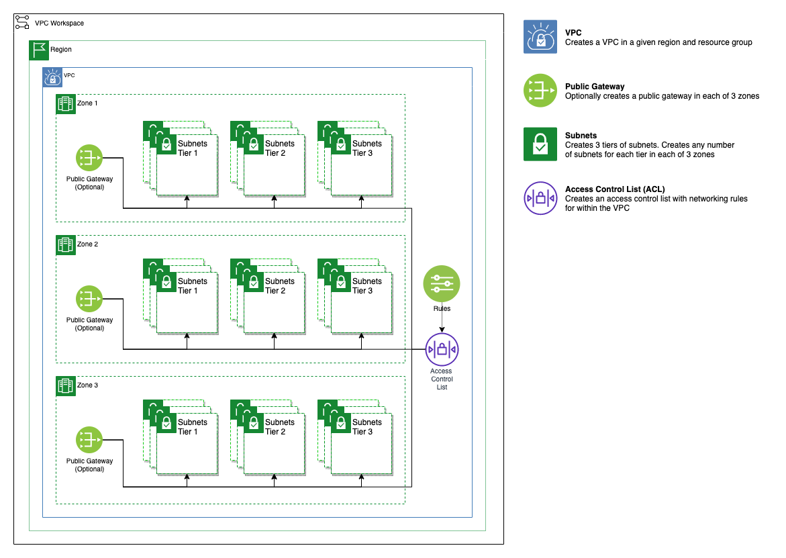

# Multitier VPC

This module creates a multizone VPC with one subnet in each zone

## Creates

- VPC
- An example ACL
- 3 Public Gateways, one in each zone
- 3 tiers each containing:
    - 3 Subnets, one in each zone each attached to the ACL and the public gateway for the correct zone
    - 3 subnet prefixes

## Outputs

Name                | Value
--------------------|-------
`tier_1_subnet_ids` | List of subnets created by module for tier 1
`tier_2_subnet_ids` | List of subnets created by module for tier 2
`tier_3_subnet_ids` | List of subnets created by module for tier 3
`vpc_id`            | ID of VPC created